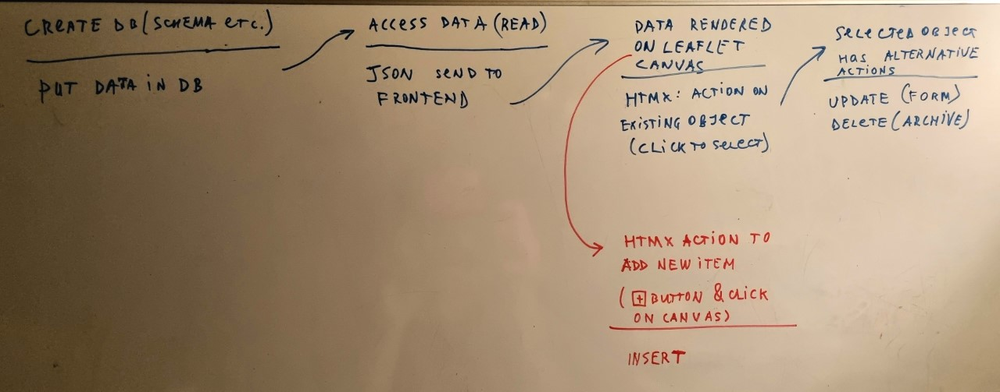
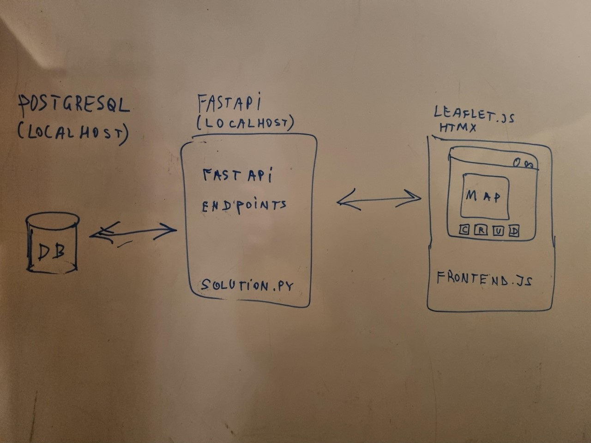

### fastapi for to serve geodata

Access postges db with Python Fastapi backend and Leaflet.js. Use HTMX to minimize javascript complexity.

Concept is visually presented here:





wich tools to use.
1. Frontend, leaflet, htmx.
2. Query db using fast api, sqlalchemy/SQLModel
4. 
--- C:\100daysofweb-with-python-course\100daysweb\3-api

TODOs:

Grab some data from here. Try to figure out how to insert it into your dummy db.
Get some time to use psycopg and sqlalchemy as per this video: <https://www.youtube.com/watch?v=d_ugoWsvGLI>
Figure outy how to use docker and if you need it at all.


### Different notes 
Figure out whether you need a Docker to put your db in it. Set up Docker container 
```
docker -v
docker pull postgres:alpine
docker run --name fastapi-postgres -e POSTGRES_PASSWORD=password -d -p 5432:5432 postgres:alpine
docker ps

docker exec -it fastapi-postgres bash

psql -U postgres

create database python_db;
create user postgres with encrypted password 'ljlkd%fFDFw12?Dg0vRiF';
 grant all privileges on database python_db to postgres_v2;
\c python_db;
 psql -h localhost -p 5432 postgres;

 \dt

```
 ctrl d to quit
 